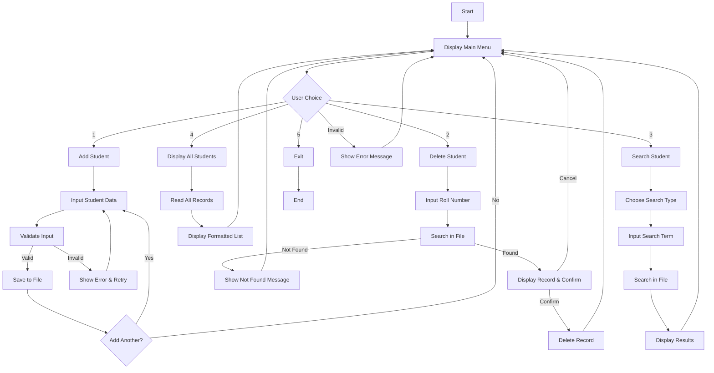
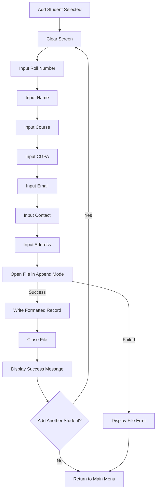
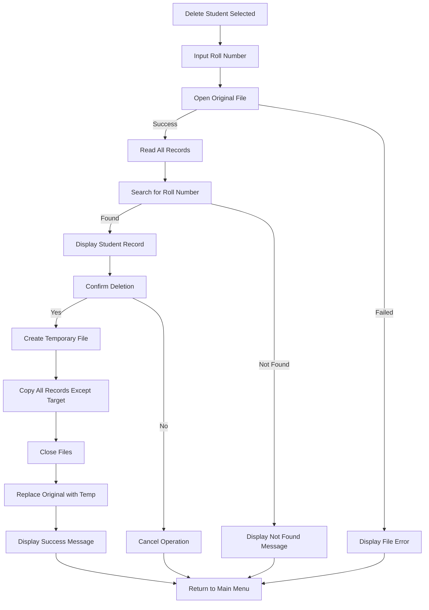
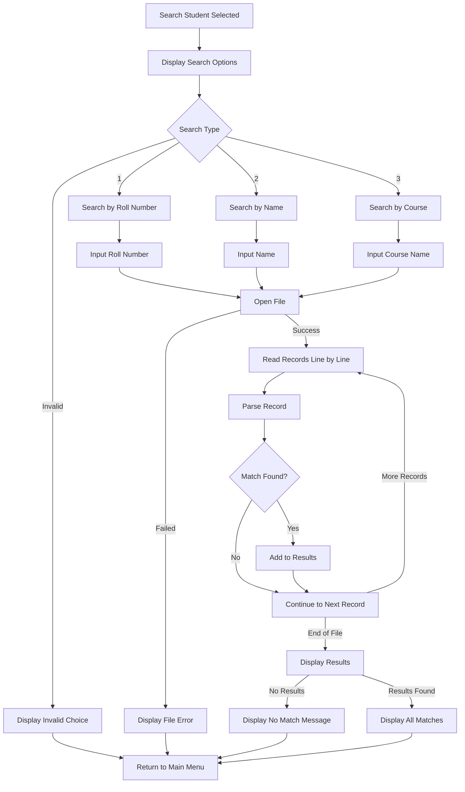
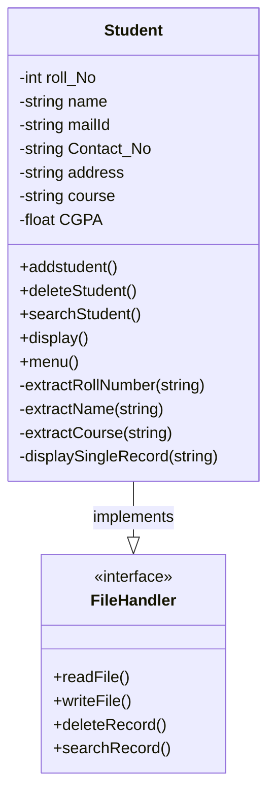

# Student Management System

A comprehensive C++ console application for managing student records with full CRUD (Create, Read, Update, Delete) operations. This system provides an intuitive menu-driven interface for educational institutions to maintain student information efficiently.

## 📋 Table of Contents

- [Features](#features)
- [System Architecture](#system-architecture)
- [Flow Diagrams](#flow-diagrams)
- [Usage](#usage)
- [File Structure](#file-structure)
- [Class Diagram](#class-diagram)
- [Data Format](#data-format)
- [Requirements](#requirements)


## ✨ Features

### Core Functionalities
- **Add Student**: Register new students with complete information
- **Delete Student**: Remove student records by roll number with confirmation
- **Search Student**: Find students by roll number, name, or course
- **Display All**: View complete list of all registered students
- **Data Persistence**: All data stored in text file format


## 🏗️ System Architecture

```
┌─────────────────────────────────────────────────────────────┐
│                    Student Management System                │
├─────────────────┬─────────────────┬─────────────────────────┤
│   User Interface│   Core Logic    │    Data Storage         │
│                 │                 │                         │
│  ┌─────────────┐│  ┌─────────────┐│  ┌─────────────────────┐│
│  │    Menu     ││  │   Student   ││  │   StudentRecord.txt ││
│  │   System    ││  │    Class    ││  │                     ││
│  └─────────────┘│  └─────────────┘│  └─────────────────────┘│
│                 │                 │                         │
│  • Add Student  │  • Data Parsing │  • Quoted String Format│
│  • Delete       │  • File I/O     │  • Line-by-line Storage│
│  • Search       │  • Validation   │  • Backup via temp files│
│  • Display      │  • Error Handle │                         │
│  • Exit         │                 │                         │
└─────────────────┴─────────────────┴─────────────────────────┘
```

## 📊 Flow Diagrams

### Main Menu Flow


### Add Student Process


### Delete Student Process


### Search Student Process



## 📖 Usage

### Main Menu Options

```
***** WELCOME TO THE SYSTEM *****

What can I do for you
1 Press one for adding a new student in the system
2 Press two for deleting a student from the system  
3 Press three for searching a student in the system
4 Press four for getting the list of the students
5 Press five for exiting the system
```

### Student Information Fields
- **Roll Number**: Unique integer identifier
- **Name**: Full name of the student
- **Course**: Academic program/course name
- **CGPA**: Cumulative Grade Point Average (float)
- **Email ID**: Student's email address
- **Contact Number**: Phone number
- **Address**: Residential address

## 📁 File Structure

```
student-management-system/
│
├── main.cpp                 # Main source code file
├── StudentRecord.txt        # Data storage file (auto-generated)
├── temp.txt                 # Temporary file for safe operations
├── README.md               # Project documentation
└── docs/
    ├── diagrams/           # System diagrams
    └── examples/           # Usage examples
```

## 🎯 Class Diagram




## 💾 Data Format

The system stores data in `StudentRecord.txt` using a quoted string format:

```
"John Doe" 101 "Computer Science" 3.75 "john.doe@email.com" "123-456-7890" "123 Main St, City"
"Jane Smith" 102 "Mathematics" 3.90 "jane.smith@email.com" "098-765-4321" "456 Oak Ave, Town"
```

### Format Structure:
```
"[Name]" [Roll_No] "[Course]" [CGPA] "[Email]" "[Contact]" "[Address]"
```

## 🔍 Key Algorithms

### 1. Record Parsing Algorithm
```cpp
// Extracts quoted strings and numeric values from file format
// Handles spaces within quoted fields
// Uses stringstream for efficient parsing
```

### 2. Safe Delete Algorithm
```cpp
// Creates temporary file for safe deletion
// Copies all records except target
// Replaces original file with temporary
// Prevents data corruption during deletion
```

### 3. Flexible Search Algorithm
```cpp
// Case-insensitive partial matching
// Multiple search criteria support
// Efficient string comparison using transform
```

## ⚙️ Requirements

### System Requirements
- **OS**: Windows (primary), Linux/macOS (with modifications)
- **RAM**: Minimum 512 MB
- **Storage**: 10 MB free space
- **Compiler**: C++11 compatible compiler

### Dependencies
- `<iostream>` - Input/output operations
- `<fstream>` - File handling
- `<string>` - String operations
- `<sstream>` - String stream processing
- `<conio.h>` - Console I/O (Windows specific)
- `<vector>` - Dynamic arrays
- `<algorithm>` - STL algorithms

## 🚀 Future Enhancements

### Planned Features
- [ ] Data encryption for sensitive information
- [ ] Export to CSV/Excel format
- [ ] Advanced reporting and analytics
- [ ] Multi-user access control
- [ ] Database integration (SQLite/MySQL)
- [ ] GUI implementation using Qt/GTK
- [ ] Network-based multi-client support
- [ ] Backup and restore functionality

### Performance Improvements
- [ ] Indexed searching for large datasets
- [ ] Memory optimization for large files
- [ ] Concurrent file access management
- [ ] Caching frequently accessed records


### Code Style Guidelines
- Use camelCase for function names
- Use PascalCase for class names
- Include proper error handling
- Add comments for complex logic
- Follow consistent indentation (4 spaces)

## 🐛 Known Issues

- **Windows Dependency**: Uses Windows-specific headers (`conio.h`)
- **File Locking**: No concurrent access protection
- **Memory Usage**: Loads entire file into memory for operations
- **Input Validation**: Limited validation for email and phone formats


## 📞 Support

For support and questions:
- Create an issue on GitHub
- Email: navdeep24816@gmail.com


---
 
**Last Updated**: 2025
**Author**: Navdeep Singh  